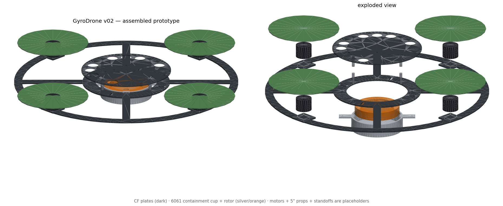

# FlyGimbal: Systems Integration for Autonomous Control

## 🚀 Overview
FlyGimbal is an open-source framework dedicated to the rigorous integration of theoretical control systems with physical hardware constraints. We bridge the gap between abstract pathfinding algorithms and tangible mechanical execution, enabling the design, simulation, and control of dynamic physical systems with high precision and stability.

## 💡 The Problem
Complex physical systems (like gimbals, robotics, or autonomous vehicles) require extremely precise control. Traditional development often suffers from a disconnect: theoretical control algorithms don't always perfectly map to physical limitations, structural constraints, or real-time momentum dynamics.

## ✨ The Solution
FlyGimbal provides a unified framework where **Simulation-First** design leads to reliable physical implementation. We integrate mechanical design (CAD) with dynamic control (Momentum Management) to ensure that the software commands are physically achievable and stable.

## 🧠 Core Philosophy
Our approach is built on three pillars:

1.  **Simulation-First:** Validate all control strategies and mechanical designs in a virtual environment ([src/simulation/](src/simulation/)) before deploying to hardware, drastically reducing physical prototyping time and risk.
2.  **Precision Control:** Implement advanced algorithms for momentum management and pathfinding that account for dynamic inertia, ensuring smooth, stable, and energy-efficient movement.
3.  **Hardware Grounding:** Ensure that software decisions are grounded in physical reality by tightly integrating CAD specifications ([cad-specs/](cad-specs/), [cad/](cad/)) and firmware changes ([src/firmware-patch/](src/firmware-patch/)).


## 🛸 The Prototype
The first FlyGimbal platform is a 400 mm disc-frame UAV built on three physics ideas that conventional quads ignore:

1.  **Gyroscopic stabilization:** a perimeter-heavy disc frame and a spinning flywheel resist unwanted attitude changes.
2.  **Flywheel energy storage (FESS):** a VESC-driven flywheel stores energy on descents and braking, then gives it back.
3.  **Momentum-aware pathfinding:** Dubins arc paths whose turn radius tightens as the flywheel charges, so the drone uses its momentum instead of cancelling it.

| Feature | Conventional Quad | FlyGimbal |
|---|---|---|
| Frame shape | X or H | Disc, 400 mm |
| Stability source | Software PID | Physics + PID + flywheel feed-forward |
| Energy recovery | None | Flywheel FESS via VESC |
| Path planning | Stop-and-go waypoints | Continuous Dubins arcs |
| Thrust vectoring | RPM differences only | Two servo-gimballed motors |



## 📍 Project Status
- [x] Phase 0: Concept and architecture
- [x] Phase 0.5: Physics simulation, including wind, gusts and sensor noise
- [ ] Phase 1: Frame and basic flight. v02 CAD is generated. Parts ordering is next.
- [ ] Phase 2: Flywheel integration. The containment cup is modelled and must be machined before spin-up.
- [ ] Phase 3: Companion computer and pathfinding on hardware
- [ ] Phase 4: Tuning and benchmarking

**Software validated ahead of hardware**, all against real ArduCopter SITL:
- [x] Momentum manager and ArduCopter integration: 7/7 checks
- [x] Flight-controller Lua script, gain scheduling and failsafes on stock firmware: 6/6
- [x] ArduPilot firmware patch, gyroscopic feed-forward in the 400 Hz rate loop: 7/7
- [x] SITL flight demo: arm, take off, hover, land

Details are in [docs/ROADMAP.md](docs/ROADMAP.md) and [docs/SITL_TESTING.md](docs/SITL_TESTING.md).

## 🛠️ Key Modules
| Path | What it does |
|---|---|
| [src/simulation/](src/simulation/) | 6-DOF physics simulation of the full system, with an 8-panel dashboard |
| [src/pathfinding/](src/pathfinding/) | Momentum-aware Dubins planner and MAVLink path upload |
| [src/momentum-manager/](src/momentum-manager/) | Companion-computer daemon that coordinates flywheel, flight controller and planner |
| [src/fc-lua/](src/fc-lua/) | ArduPilot Lua script for flywheel gain scheduling and failsafes |
| [src/firmware-patch/](src/firmware-patch/) | ArduPilot patch adding true gyroscopic feed-forward |
| [cad-specs/](cad-specs/) and [cad/](cad/) | Design specs and released STL, STEP and DXF geometry |
| [tools/](tools/) | CAD generation, render, STL audit, SITL demo and log reader |
| [tests/](tests/) | Pytest suite for the sampler, planner and simulation |

The full layout is in [docs/STRUCTURE.md](docs/STRUCTURE.md).

## ⚙️ Technology Stack
*   **Python:** simulation, path planning, companion-computer software, tests.
*   **ArduPilot:** ArduCopter 4.5+ on a Matek H743, a Lua script and a small C++ patch.
*   **CadQuery and Fusion 360:** parametric parts and hand-modelled parts.
*   **VESC:** flywheel motor control and regenerative braking.

## 🤝 Getting Started
1.  **Clone the repository:**
    ```bash
    git clone https://github.com/williamag929/FlyGimbal.git
    cd FlyGimbal
    ```
2.  **Set up the environment:**
    ```bash
    python -m venv .venv
    source .venv/bin/activate  # or .venv\Scripts\activate on Windows
    pip install -r requirements.txt
    ```
3.  **Run the simulation.** No hardware is needed.
    ```bash
    python src/simulation/gyrodrone_sim.py                      # 5-waypoint circuit
    python src/simulation/gyrodrone_sim.py --mission figure8    # also: square, lawnmower
    python src/simulation/gyrodrone_sim.py --no-regen           # flywheel regen off
    python src/simulation/gyrodrone_sim.py --wind 8 --gust 3 --noise
    python src/simulation/gyrodrone_sim.py --no-plot            # console summary only
    ```
    With plotting on, it also saves `gyrodrone_simulation.png`, an 8-panel dashboard.
4.  **Run the tests:**
    ```bash
    pytest tests/ -v
    ```
5.  **Go further:** test against ArduCopter with [docs/SITL_TESTING.md](docs/SITL_TESTING.md), or build the airframe with [docs/BUILD_GUIDE.md](docs/BUILD_GUIDE.md).

## 📚 Documentation
| Document | Contents |
|---|---|
| [docs/PHYSICS.md](docs/PHYSICS.md) | Theory: gyroscopic stability, FESS, momentum-aware paths |
| [docs/ROADMAP.md](docs/ROADMAP.md) | Phases, progress and validated results |
| [docs/STRUCTURE.md](docs/STRUCTURE.md) | Repository layout and where each piece runs |
| [docs/BOM.md](docs/BOM.md) | Bill of materials and cost by phase |
| [docs/BUILD_GUIDE.md](docs/BUILD_GUIDE.md) | Phase 1 assembly |
| [docs/SITL_TESTING.md](docs/SITL_TESTING.md) | Software-in-the-loop setup and results |
| [cad/README.md](cad/README.md) | What to order, what to machine, what to print |
| [docs/CONTRIBUTING.md](docs/CONTRIBUTING.md) | How to contribute |

## 📄 License
MIT. See [LICENSE](LICENSE). Build it, modify it, fly it.
