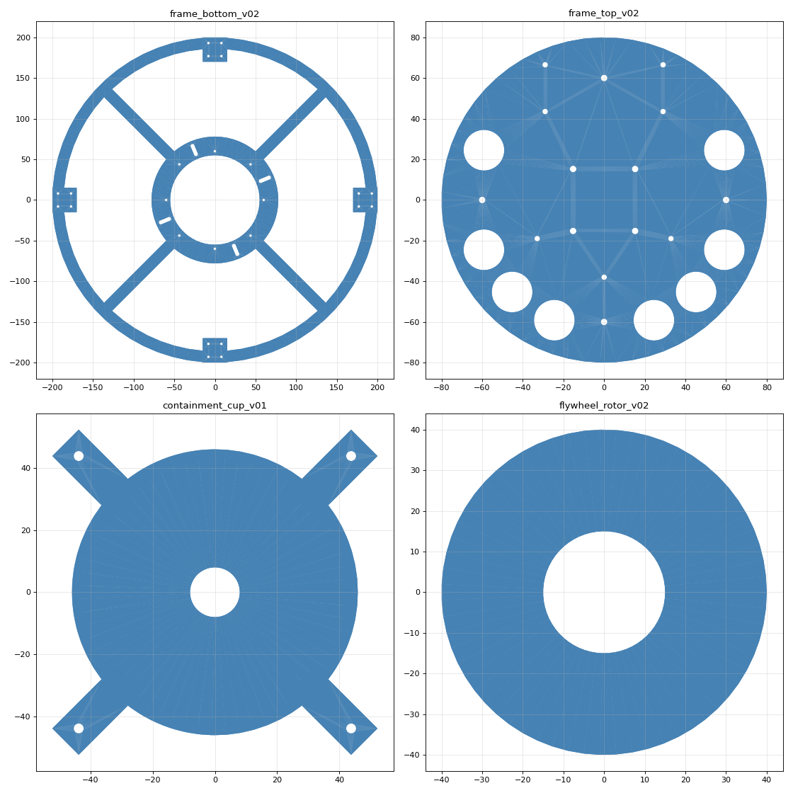

# CAD Geometry — GyroDrone

Released geometry. Specs live in [cad-specs/](../cad-specs/); v02 parts are
generated parametrically by [tools/generate_cad_v02.py](../tools/generate_cad_v02.py)
(CadQuery) — edit parameters there and re-run rather than editing exports.

```
.venv/Scripts/python tools/generate_cad_v02.py   # regenerates all v02 parts
.venv/Scripts/python tools/stl_check.py cad/stl  # mass / inertia audit
```



## Inventory

| Part | Version | Source | Material | Mass | Status |
|---|---|---|---|---|---|
| frame_bottom | v01 | Fusion 360 | 3mm CF | ~255 g | superseded by v02 (2.5× over budget) |
| frame_bottom | **v02** | generator | 3mm CF | ~164 g | STL + STEP + DXF; needs fillets in Fusion |
| frame_top | v01 | Fusion 360 | 2mm CF | ~201 g | superseded by v02 |
| frame_top | **v02** | generator | 2mm CF | ~56 g | STL + STEP + DXF (R80 tray) |
| flywheel_rotor | v01 | Fusion 360 | 6061 | ~118 g, I=1.24e-4 | **default** — software constants match this |
| flywheel_rotor | v02 | generator | 6061 | ~164 g, I=1.78e-4 | optional heavy rotor; update 4 software constants if built |
| containment_cup | v01 | generator | 6061 | ~102 g | **required before Phase 2 spin-up** |
| flywheel_boss | v01 | Fusion 360 | PETG | — | ⚠ flange bolt circle must move 55→62 mm for v02 plate |
| gimbal_servo_mount | v01 | Fusion 360 | PETG | — | current |
| gimbal_motor_plate | v01 | Fusion 360 | PETG | — | current |
| vesc_mount_bracket | v01 | Fusion 360 | PETG | — | current |
| landing_leg | v01 | Fusion 360 | TPU | — | current |

## Layout

- `stl/` — STL meshes (print / reference)
- `stl/step/` — STEP solids (CNC quoting: rotor, cup, plates)
- `dxf/` — 2D cut profiles for CF plate CNC (SendCutSend / PCBWay)

Masses verified with `tools/stl_check.py` (exact tetrahedron volume +
inertia integrals). CF at 1.6 g/cm³, 6061 at 2.70 g/cm³.
