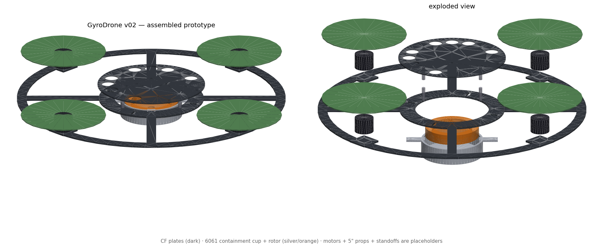

# CAD Geometry — GyroDrone

Released geometry. Specs live in [cad-specs/](../cad-specs/); v02 parts are
generated parametrically by [tools/generate_cad_v02.py](../tools/generate_cad_v02.py)
(CadQuery) — edit parameters there and re-run rather than editing exports.

```
.venv/Scripts/python tools/generate_cad_v02.py   # regenerates all v02 parts
.venv/Scripts/python tools/stl_check.py cad/stl  # mass / inertia audit
```


*Rendered from the released STLs by `tools/render_assembly.py` — motors,
props, and standoffs are placeholders. Left: assembled. Right: exploded,
showing the flywheel rotor (orange) inside the containment cup under the
bottom plate.*


## Who makes what

### 1. Waterjet-cut carbon fiber — order from SendCutSend (send the DXF)

SendCutSend waterjet-cuts carbon fiber and stocks our exact thicknesses
(3.00 mm and 2.01 mm); the 400 mm plates fit their 23″×44″ envelope.
PCBWay CNC is the cheaper-but-slower alternative.

| File to upload | Material to select |
|---|---|
| `dxf/frame_bottom_v02.dxf` | Carbon fiber, .118″ (3.00 mm) |
| `dxf/frame_top_v02.dxf` | Carbon fiber, .079″ (2.01 mm) |

> ⚠ SendCutSend's minimum hole in CF is ~3.2 mm. The M3 holes (ø3.2) are
> exactly at the limit — OK. The top plate's M2.5 holes (ø2.7, companion
> computer + IMU grommets) are below it: either let them cut ø3.2 there too
> (use M3 hardware instead) or have them skip those holes and hand-drill.

### 2. CNC-machined aluminum — order from PCBWay / Xometry / local shop (send the STEP)

**Never 3D print these two** — one stores 272 J at 84 m/s rim speed, the
other is the safety part that contains it if it bursts.

| File to upload | Material |
|---|---|
| `stl/step/flywheel_rotor_v01.step` (**default rotor**) | 6061-T6 |
| `stl/step/containment_cup_v01.step` | 6061-T6 |
| `stl/step/flywheel_rotor_v02.step` — only if you want the heavy rotor | 6061-T6 |

### 3. 3D print at home (slice the STL)

Settings per FRAME_SPEC: 0.2 mm layers, 4 perimeters, 40% gyroid infill.

| File | Material |
|---|---|
| `stl/gimbal_servo_mount_v01.stl` | PETG |
| `stl/gimbal_motor_plate_v01.stl` | PETG |
| `stl/vesc_mount_bracket_v01.stl` | PETG |
| `stl/landing_leg_v01.stl` (×4) | TPU |
| `stl/flywheel_boss_v01.stl` | PETG — **⚠ don't print yet**: flange bolt circle must move 55→62 mm to match the v02 plate |

Tip: the frame plates can also be printed in PETG/ASA first as a cheap
fit-check before ordering the carbon fiber.

## Inventory

| Part | Version | Source | Material | Mass | Status |
|---|---|---|---|---|---|
| frame_bottom | v01 | Fusion 360 | 3mm CF | ~255 g | superseded by v02 (2.5× over budget) |
| frame_bottom | **v02** | generator | 3mm CF | ~164 g | STL + STEP + DXF; needs fillets in Fusion |
| frame_top | v01 | Fusion 360 | 2mm CF | ~201 g | superseded by v02 |
| frame_top | **v02** | generator | 2mm CF | ~56 g | STL + STEP + DXF (R80 tray) |
| flywheel_rotor | v01 | Fusion 360 | 6061 | ~118 g, I=1.24e-4 | **default** — software constants match this |
| flywheel_rotor | v02 | generator | 6061 | ~164 g, I=1.78e-4 | optional heavy rotor; update 4 software constants if built |
| containment_cup | v01 | generator | 6061 | ~102 g | **required before Phase 2 spin-up** |
| flywheel_boss | v01 | Fusion 360 | PETG | — | ⚠ flange bolt circle must move 55→62 mm for v02 plate |
| gimbal_servo_mount | v01 | Fusion 360 | PETG | — | current |
| gimbal_motor_plate | v01 | Fusion 360 | PETG | — | current |
| vesc_mount_bracket | v01 | Fusion 360 | PETG | — | current |
| landing_leg | v01 | Fusion 360 | TPU | — | current |

## Layout

- `stl/` — STL meshes (print / reference); superseded v01 frame plates shelved in `stl/v01/`
- `stl/step/` — STEP solids (CNC quoting: rotor, cup, plates); superseded v01 plates in `stl/step/v01/`
- `dxf/` — 2D cut profiles for CF plate CNC (SendCutSend / PCBWay)

Masses verified with `tools/stl_check.py` (exact tetrahedron volume +
inertia integrals). CF at 1.6 g/cm³, 6061 at 2.70 g/cm³.
